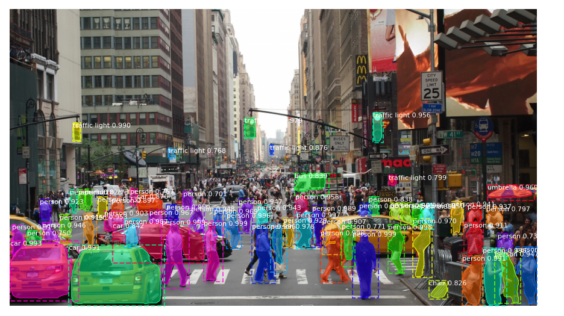

# MaskRCNN_TF2

Mask RCNN implementation code compatible with Tensorflow Version 2.

Made changes to the original version of Matterport Mask_RCNN, which was only compatible with Tensorflow Version 1.

## Run

1) pip install imgaug

2) To train or test on MS COCO install pycocotools from one of these repos. They are forks of the original pycocotools with fixes for Python3 and Windows (the official repo doesn't seem to be active anymore).

Linux: https://github.com/waleedka/coco
Windows: https://github.com/philferriere/cocoapi. You must have the Visual C++ 2015 build tools on your path (see the repo for additional details)

3) Download pre-trained COCO weights (mask_rcnn_coco.h5) from the releases page.

https://github.com/matterport/Mask_RCNN/releases

4) python demo.py
